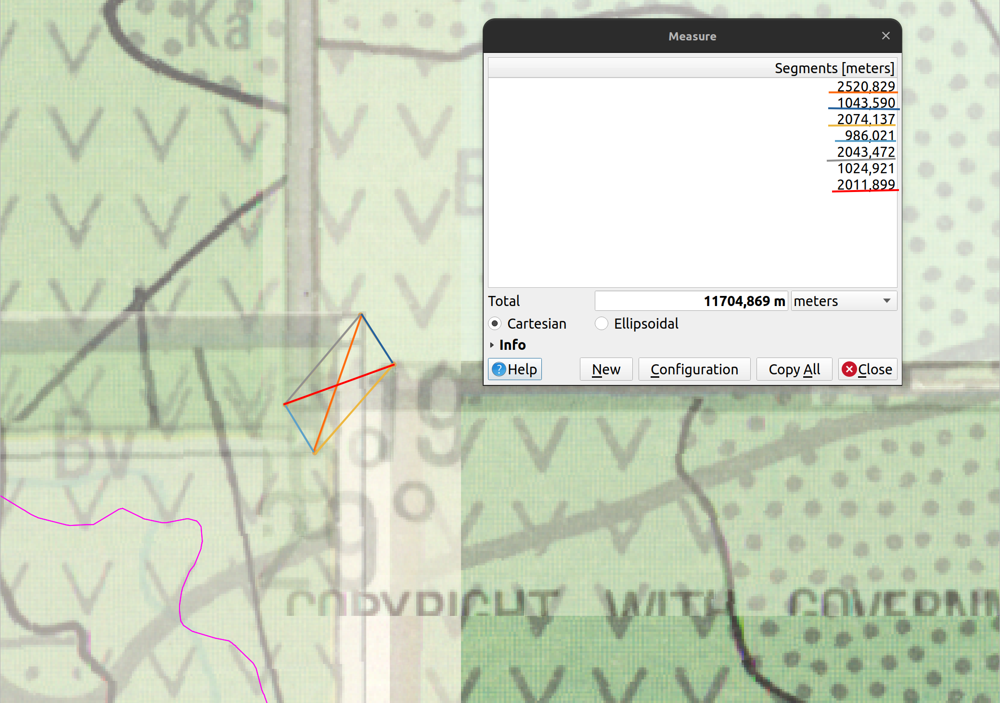

# IGRAC: Georeferencing Methodology

The objectives of this project are:

* To georeference the geological maps from Zimbabwe and Mozambique.
* Digitize the georeferenced sheets capturing the primary features on the sheets.
* Symbolize the vector features that have been captured. 

The primary software that will be used for this is QGIS. The tasks in this project will be split into the three distinct 
sections based on the aims mentioned above.

## Georeferencing MapSheets

The map sheets covers Zimbabwe and Mozambique. The methodology used to georeference and digitize the features will 
largely depend on the quality of the provided map sheets. The process of georeferencing the maps depends on several
factors:

* What is the spatial resolution of the current map sheets.
* What is the date at which the map sheets were acquired (produced)
* Coordinate reference system of the map sheets.
* What transformation algorithm to use. QGIS provides plenty of these and detailed explanation cen be found from
[Georef transformation algorithms](https://docs.qgis.org/testing/en/docs/user_manual/working_with_raster/georeferencer.html?highlight=georeferencer#available-transformation-algorithms)

For more information about the QGIS Georeferencing can be found on the [QGIS Documentation website](https://docs.qgis.org/testing/en/docs/user_manual/working_with_raster/georeferencer.html?highlight=georeferencer#id7)

## Mozambique

There are two map sheets which are provided
* Southern Sheet
* Northern Sheep

The georeferencing process will likely be the same on these two sheets.

### Analysis of map sheets before georeferencing

After loading the raster images (`Mozambique Hydrological Map_North Region` and `Mozambique Hydrological Map_South Region` geotiff) 
into QGIS and doing some investigation. The following conclusion were established:

* The Coordinate Reference System (CRS) for the Mozambique geotiff was unknown. In the  `Legenda (legend)` on 
the `Mozambique Hydrological Map_South Region` image, it is stated 
"Projeccao Conica Conforme de Lambert" (Lambert Conic Conformal Projection).The Lambert Conic Conformal Projection 
requires two parallels, a central meridian, and a Datum. The two parallels and the central meridian were obtained 
from the scanned maps, and then through research the datum was discovered to be the Tete datum (discovered through this
[column](https://www.ingentaconnect.com/contentone/asprs/pers/2017/00000083/00000005/art00005?crawler=true&mimetype=application/pdf)
by Clifford J. Mugnier for ASPRS.org). A custom CRS was the made using that information.

* The need to create a new custom CRS to use in QGIS for the georeferencing.
The custom CRS using the Tete datum worked but, due to lack of information on the scanned images, was not accurate for 
georeferencing. A new custom CRS based on the WGS84 datum was made using the proj4 string:

   ```
   +proj=lcc +lat_0=0 +lon_0=35.5 +lat_1=-14 +lat_2=-24 +x_0=0 +y_0=0 +datum=WGS84 +untis=m +no_defs
   ```

   The new CRS was made to save having to datum transformations in the future. It was then decided that
   georeferencing would be done using the GAUL dataset for reference points because a graticule
   transformation was not possible.

**Note:** Sample QGIS projects will be provided for users to explore and analyze. The GAUL dataset, as this was the 
suggested reference dataset. The dataset is available from [here](https://geonode.wfp.org/geoserver/wfs?format_options=charset%3AUTF-8&typename=geonode%3Aadm1_gaul_2015&outputFormat=SHAPE-ZIP&version=1.0.0&service=WFS&request=GetFeature)


### Georeferencing Mozambique Southern Region

**Note:** Multiple iterations were required as the georeferencing was done against a reference dataset and could not
be done by simply taking the corner graticules from the geotiff and projecting them into the custom CRS.


#### Georefencing Parameters
Georeferencing is an iterative process, and we needed to try different parameters to establish
the most suitable ones to use.

The methods below describe the different parameters that were tested with the raster images.

#### Test Parameters
This describes the parameters that were tested and we found to be not adequate to use for georeferencing.

1. The first iteration of georeferencing the Southern Region of Mozambique was done using a linear transformation.
   The resulting image ended up being too different to the reference dataset spatially and so was immediately discarded.
   

2. The second iteration was done using a `Helmert transformation` and gave a decent result but there were far too many
   discrepancies between the reference layer and the georeferenced image.

3. The third iteration was done using the `Helmert Transformation` again but with all Residual pixels for the
   Ground Control Points (CPs) being under 10. 9 GCPS were used for the referencing. There were too many discrepancies
   between the reference dataset and the georeferenced image, so it was disregarded as a viable image.

4. The fourth iteration was done using a `Polynomial 1 Transformation` (with all residual pixels less than 10) and
   12 GCPs. Again, there were too many discrepancies between the reference dataset and the georeferenced image but
   there was minimal warping on the polygons.

5. The fifth iteration was done using a `Polynomial 2 Transformation` (with all residual pixels less than 10) and 17
   GCPs. There were fewer discrepancies between the reference dataset and the georeferenced image than in the previous
   iterations but there was slight warping on the polygons.

6. The sixth iteration was done using a `Polynomial 3 Transformation` (with all residual pixels less than 10) and 18
   GCPs. There were fewer discrepancies between the reference dataset and the georeferenced image than in the previous
   iterations but there was warping on the polygons.

7. The seventh iteration was done using a `Thin Plate Spline transformation`. All residual pixels were zero but this was
   likely a false result. This iteration had the best results for lining up the georeferenced image with the reference
   dataset. 102 GCPs were used to help correct discrepancies from previous iterations. The issue with this
   transformation
   was the significant warping of the polygons in the georeferenced image.

#### Best Candidate Parameters to Use

For the last iteration, it was decided that the `Polynomial 1 transformation` warped the internal polygons of
Mozambique's Southern Region the least but more GCPs would help with the discrepancies between the reference dataset
and the tif. 55 GCPs, with residual pixels lower than 10, were used for the georeferencing and ended up with the best
result. The image below shows the georeferencer with the GCPs on the map and the GCP table showing the residuals
being below 10 (Ground Control Point 40 has the highest Residual Pixels at 8.976885).


The image below shows the GCPs for Mozambique's Southern Region relative to the GAUL reference dataset.


The GCPs for Mozambique's Southern Region can be found [here](gcps/MozSouth_Poly1.points). There were still small
discrepancies between the georeferenced image and the reference dataset but to correct the discrepancies would warp
the polygons too much to be a viable image.

### Georeferencing Mozambique Northern Region

**Note:** Fewer iterations were required for the Northern Region of Mozambique as it was done using knowledge gained
from georeferencing the Southern Region. The first 2 iterations were also done before the final iteration of
georeferencing the Zouth Region of Mozambique so were done before it was decided that using the Thin Plate Spline
transformation was providing false results.

1. The first iteration was done using the `Thin Plate Spline transformation` where all the residual pixels were a false
   zero. 10 GCPs were used and resulted in good approximation that had some discrepancies between the georeferenced
   image
   and the reference dataset.

2. The second iteration also used the `Thin Plate Spline transformation`. All the Residual Pixels were zero. Points were
   added to the previous attempt's GCPs to total 201 GCPs. The Northern Region of Mozambique had many small islands and
   outlying points that had to be 'forced' into the correct place.

3. The last iteration of georeferencing Mozambique's Northern Region was done using a `Polynomial 3 transformation`
   with 149 GCPs. All the Residual Pixels for the GCPs were under 10. A polynomial 3 transformation was chosen as it
   warped the image the least but had the fewest discrepancies between the reference dataset and the georeferenced
   image. The image below shows the georeferencer with the GCPs on the map and the GCP table showing the residuals being
   below 10 (Ground Control Point 124 has the highest Residual Pixels at 9.948533).
   

   The image below shows the GCPs for Mozambique's Northern Region relative to the GAUL reference dataset.
   

   The GCPs for Mozambique's Northern Region can be found [here](gcps/MozNorth_Poly3.points).

### Checking Alignment of georeferenced Mozambique Images

<!--Need to add more to this section-->
Due to the nature of the scanned maps, there are slight discrepancies where the sheets meet each other but they are
minimal.


The main discrepancy for Mozambique's Southern Region between the southernmost border of the **Mozambique
Hydrogeological Map_South Region** tif and the GAUL reference dataset.
<!-- At the original scale of the map (1:1 000 000) the discrepancies are within an acceptable error range. 1942.229m 
discrepancy at map scale = 1.9 mm error on the original map?-->


There are multiple discrepancies between the Northern Border of **Mozambique Hydrogeological Map_North Region** tif and
the GAUL reference dataset. There are discrepancies where the administration boundary on the map and the GAUL boundray
differ, and where the Ruvuma (formerly Rovuma) River's path on the **Mozambique Hydrogeological Map_North Region** tif
differs from its path on the GAUL dataset( the path on the GAUL dataset is ratified by GLAD Landsat imagery).


A closer look at one of the worse discrepancies:


<!-- At the original scale of the map (1:1 000 000) the discrepancies are within an acceptable error range. 3465.166m
discrepancy at map scale = 3.4 mm error on the original map?-->

## Zimbabwe

1. Create a QGIS project for Zimbabwe and import the four Zimbabwe sheets into the project.

2. Attempt to find any info about Zim projection, datum, etc. through research. Finding the memoir for the sheets would
   be the ideal situation. The maps being from 1986 mean that their projection system was most likely based on the Arc
   1950 datum (which is based on the Clarke 1880 ellipsoid).

3. Research did not yield the projection used for creating the sheets. The projection is required to make custom
   projected CRS for better georeferencing. The closest option found during research was a report from UNESCO from
   1995 (Hydrogeological Maps A Guide and Standard Legend. Vol. 17., by Struckmeier, Wilhelm F, and Jean Margat)
   referencing the Zimbabwe Hydrogeological maps stating that "preferably UTM grid" was used for map locations. Using
   this information, a custom tmerc (Transverse mercator) projection system was made using the proj string:

    ```
    Custom CRS: +proj=tmerc +lat_0=-19 +lon_0=30 +k=1 +x_0=0 +y_0=0 +a=6378249.145 +rf=293.4663077 +units=m +no_defs
    ```

   The Central Meridian (lon_0) and the Latitude of Origin (lat_0) were taken from the Zimbabwe sheets and the **+a**
   and **+rf** values are for the Arc 1950 datum.

### Georeferencing Zimbabwe Sheets 1 through 4

1. The first iteration of georeferencing Zimbabwe Sheet 1 was done using a `Thin Plate Spline transformation` using 11
   GCPS. There were multiple discrepancies between the georeferenced image and the reference image.

2. The first iteration of georeferencing Zimbabwe Sheet 2 was done using a `Thin Plate Spline transformation` using 12
   GCPS. There were multiple discrepancies between the georeferenced image and the reference image.

3. The first iteration of georeferencing Zimbabwe Sheet 3 was done using a `Thin Plate Spline transformation` using 8
   GCPS. There were multiple discrepancies between the georeferenced image and the reference image.

4. The first iteration of georeferencing Zimbabwe Sheet 4 was done using a `Thin Plate Spline transformation` using 12
   GCPS. There were multiple discrepancies between the georeferenced image and the reference image. It was the best
   result of the initial georeferencing attempts so will be refined first and then used as a basis for the other images.

### Refining Zimbabwe Sheet 4

1. The initial refinement of Zimbabwe sheet 4 was done using a `Thin Plate Spline transformation` with 46 GCPS. There were
   still discrepancies between the GAUL reference dataset and the georeferenced sheet's boundaries.

2. The second iteration of refining Zimbabwe sheet 4 was done using a `Thin Plate Spline transformation` with 75 GCPS.
   There were still major discrepancies between the GAUL reference dataset and georeferenced sheet's boundaries. This
   transformation type also warped the internal polygons of the georeferenced image.

3. After a discussion, it was decided that the Residual Pixels from a `Thin plate Spline transformation` being zero was a
   false reading and so a Polynomial 3 transformation was chosen as it gave the best results. 42 GCPs were used with all
   the Residual Pixels being less than 10 (Point 16 was the GCP with the highest Residual Pixel value of 9.592993). The
   image below shows the georeferencer and part of the associated GCP table:
   

   The image below shows the GCPs for Zimbabwe Sheet 4 relative to the GAUL reference dataset over the GLAD Landsat
   dataset.
   

The GCPs can be found [here](gcps/zimbabwe_sheet4_Poly3.points).

> There was not a lot of spatial information in the North Western section (Central region of Zimbabwe) of the sheet and
> the roads that are represented on the scanned map do not intersect with each other as they would in the real world.

### Refining Zimbabwe Sheet 3

1. The initial refinement of Zimbabwe Sheet 3 was done using a `Thin Plate Spline transformation` with 29 GCPS. There were
   significant discrepancies between the GAUL reference dataset and georeferenced sheet's boundaries.

2. The second iteration of refining Zimbabwe Sheet 3 was done using a `Polynomial 1 transformation` with 11 GCPs. All the
   Residual Pixels for the GCPs were lower than 10. Despite Sheet 3 having all if its GCPs be lower values than Sheet
   4's GCPs it had greater discrepancies along its western boundary.
   

   The image below shows the georeferencer and part of the associated GCP table (Point 7 was the GCP with the highest
   Residual Pixel value of 1.211239):
   

   The image below shows the GCPs for Zimbabwe Sheet 4 relative to the GAUL reference dataset over the GLAD Landsat
   dataset.
   

The GCPs can be found [here](gcps/zimbabwe_sheet3_Poly1.points). A `Polynomial 1 transformation` was used as it gave the
best result out of the transformation types.

> There was not a lot of spatial information in the North Eastern section (Central region of Zimbabwe) of the sheet and
> the roads that are represented on the scanned map do not intersect with each other as they would in the real world.

### Refining Zimbabwe Sheet 2

1. The initial refinement of Zimbabwe sheet 2 was done using a Thin Plate Spline transformation with 53 GCPS. There were
   significant discrepancies between the GAUL reference dataset and georeferenced sheet's boundaries.

2. The second iteration of refining Zimbabwe Sheet 2 was done using a Polynomial 3 transformation with 27 GCPs. All the
   Residual Pixels for the GCPs were lower than 10. The image below shows the georeferencer and part of the associated
   GCP table (Point 18 was the GCP with the highest Residual Pixel value of 9.794608):
   

   The image below shows the GCPs for Zimbabwe Sheet 2 relative to the GAUL reference dataset over the GLAD Landsat
   dataset.
   

The GCPs can be found [here](gcps/zimbabwe_sheet2_Poly3.points). A Polynomial 3 transformation was used as it gave the
best result out of the transformation types.

> There was not a lot of spatial information in the South Western section (Central region of Zimbabwe) of the sheet and
> the roads that are represented on the scanned map do not intersect with each other as they would in the real world. The
> Great Dyke was used where it was clear that a GCP could be placed.

### Refining Zimbabwe Sheet 1

1. The initial refinement of Zimbabwe sheet 1 was done using a Thin Plate Spline transformation with 53 GCPS. There were
   significant discrepancies between the GAUL reference dataset and georeferenced sheet's boundaries.

2. The second iteration of refining Zimbabwe Sheet 1 was done using a Polynomial 1 transformation with 23 GCPs. A
   Polynomial 1 transformation was used as it gave the best result out of the transformation types. Lake Kariba would
   have been ideal for reference points, however in the years since the map was published Lake Kariba's water level has
   lowered significantly and the shoreline has changed. All the Residual Pixels for the GCPs were lower than 10 (Point
   17 was the GCP with the highest Residual Pixel value of 7.111510).
   

   The image below shows the GCPs for Zimbabwe Sheet 1 relative to the GAUL reference dataset over the GLAD Landsat
   dataset.
   

The GCPs can be found [here](gcps/zimbabwe_sheet1_Poly1.points).

> There was some clear spatial information in the South Eastern section (Central region of Zimbabwe) of the sheet and
> the roads that are represented on the scanned map do not intersect with each other as they would in the real world. The
> Shangani River was used where it was clear that GCPs could be placed.

### Checking Alignment of Zimbabwe sheets

<!--Need to add more to this section-->
Due to the nature of the scanned maps, there are discrepancies where the sheets interact with eachother and there was a
lack of reference information to be used as GCPs. The main discrepncies are where the four sheets meet in the central
area of Zimbabwe. The discrepancies and their respective measurements are highlighted using the same coloured lines in
the image below. The discrepancies between sheets edges get smaller closer to the country boundary of Zimbabwe due to
there being multiple GCPs along the administration boundary.
<!-- The largest discrepancy is 2.52 km which would be an error of 2.5 mm on the original map-->


### Refining Zimbabwe Georeferencing

It was noticed that the original images provided were already warped before any form of georeferencing took place. This
meant that the original images didn't line up correctly with eachother. This issue meant that the original
georeferencing had major discrepancies in the central region of Zimbabwe.

The solution to this issue was to stitch the images together in an external software (Inkscape) and then georeference
this stitched image. The stitched together image and its associated GCPs looked like this:


All the Residual Pixels for the GCPs were less than 10 (Point 0 having the highest residual pixel value of 9.662356).
This image gave the best result of the georeferencing so was used for the digtization process.

The GCPs can be found [here](gcps/zim_stitched_poly3.points).
