# IGRAC: Georeferencing Methodology

The objectives of this project are:

* To georeference the geological maps from Zimbabwe and Mozambique.
* Digitize the georeferenced sheets capturing the primary features on the sheets.
* Symbolize the vector features that have been captured.

The primary software that will be used for this is QGIS. The tasks in this project will be split into the three distinct
sections based on the aims mentioned above.

## Georeferencing MapSheets

The map sheets covers Zimbabwe and Mozambique. The methodology used to georeference and digitize the features will
largely depend on the quality of the provided map sheets. The process of georeferencing the maps depends on several
factors:

* What is the spatial resolution of the current map sheets.
* What is the date at which the map sheets were acquired (produced)
* Coordinate reference system of the map sheets.
* What transformation algorithm to use. QGIS provides plenty of these and detailed explanation cen be found from
[Georeferencing transformation algorithms](https://docs.qgis.org/testing/en/docs/user_manual/working_with_raster/georeferencer.html?highlight=georeferencer#available-transformation-algorithms)

For more information about the QGIS Georeferencer can be found on the [QGIS Documentation website](https://docs.qgis.org/testing/en/docs/user_manual/working_with_raster/georeferencer.html?highlight=georeferencer#id7)

## Mozambique

There are two map sheets which are provided

* Southern Sheet
* Northern Sheep

The georeferencing process will likely be similar for these two sheets.

### Analysis of map sheets before georeferencing

After loading the raster images (`Mozambique Hydrological Map_North Region` and `Mozambique Hydrological Map_South Region` tifs)
into QGIS and doing some investigation. The following conclusion were established:

* The Coordinate Reference System (CRS) for the Mozambique raster images (.tif) was unknown. In the  `Legenda (Legend)` on
the `Mozambique Hydrological Map_South Region` image, it is stated "Projeccao Conica Conforme de Lambert"
(Lambert Conic Conformal Projection). The Lambert Conic Conformal Projection requires two parallels, a central
meridian, and a Datum. The two parallels and the central meridian were obtained from the scanned maps, and then
through research the datum was discovered to be the Tete datum (discovered through this [column](https://www.ingentaconnect.com/contentone/asprs/pers/2017/00000083/00000005/art00005?crawler=true&mimetype=application/pdf) by Clifford J.
Mugnier for ASPRS.org). A custom CRS was the made using that information.

* There is a need to create a new custom CRS to use in QGIS for the georeferencing.
The custom CRS using the Tete datum worked but, due to lack of information on the scanned images, was not accurate for
georeferencing. A new custom CRS based on the WGS84 datum was made using the proj4 string:

    ```py
    +proj=lcc +lat_0=0 +lon_0=35.5 +lat_1=-14 +lat_2=-24 +x_0=0 +y_0=0 +datum=WGS84 +units=m +no_defs
    ```

   The new CRS was made to save having to datum transformations in the future. It was then decided that
   georeferencing would be done using the GAUL dataset for reference points because a graticule
   transformation was not possible.

    
### Georeferencing Mozambique Southern Region

Multiple iterations were required as the georeferencing was done against a reference dataset and could not
be done by simply taking the corner graticules from the tif and projecting them into the custom CRS.

#### Georeferencing Parameters for Southern sheet

Georeferencing is an iterative process, and we needed to try different parameters to establish the most suitable ones
to use.

The methods below describe the different parameters that were tested with the raster images.

##### Test Parameters

This describes the parameters that were tested, and we found to be not adequate to use for georeferencing.

|Iteration| Transformation Type                  |Outcome|
|---------|--------------------------------------|-------|
|First| **Linear Transformation**            |The resulting image ended up being spatially too different from the reference dataset and so was immediately discarded. See the image below table.|
|Second| **Helmert transformation**           |Gave a decent result but there were far too many discrepancies between the reference layer and the georeferenced image|
|Third| **Helmert Transformation**           |The Helmert Transformation was used again but with all Residual pixels for the Ground Control Points (CPs) being under 10. 9 GCPs were used for the referencing. There were too many discrepancies between the reference dataset and the georeferenced image, so it was disregarded as a viable image.|
|Fourth| **Polynomial 1 Transformation**      |All of the residual pixels were less than 10 and 12 GCPs were used. Again, there were too many discrepancies between the reference dataset and the georeferenced image but there was minimal warping on the polygons.|
|Fifth| **Polynomial 1 Transformation**      |All of the residual pixels were less than 10 and 17 GCPs were used. There were fewer discrepancies between the reference dataset and the georeferenced image than in the previous iterations but there was slight warping on the polygons.|
|Sixth| **Polynomial 2 Transformation**      |All of the residual pixels were less than 10 and 18 GCPs were used. There were fewer discrepancies between the reference dataset and the georeferenced image than in the previous iterations but there was warping on the polygons.|
|Seventh| **Thin Plate Spline transformation** |All residual pixels were zero but this was likely a false result. This iteration had the best results for lining up the georeferenced image with the reference dataset. 102 GCPs were used to help correct discrepancies from previous iterations. The main issue with this transformation was the significant warping of the polygons in the georeferenced image.|

**Discarded first iteration of georeferencing Mozambique South**


##### Final Parameters Selected

After testing other types of transformations it was decided that using the `Polynomial 1 transformation` gave the best
result. This transformation type warped the internal polygons of Mozambique's Southern Region the least but more GCPs
would help to correct the discrepancies between the reference dataset and the tif. 55 GCPs, with residual pixels lower
than 10, were used for the georeferencing and ended up with the best result. The image below shows the georeferencer
with the GCPs on the map and the GCP table showing the residuals being below 10 (Ground Control Point 40 has the
highest Residual Pixels at 8.976885).


The image below shows the GCPs for Mozambique's Southern Region relative to the GAUL reference dataset.
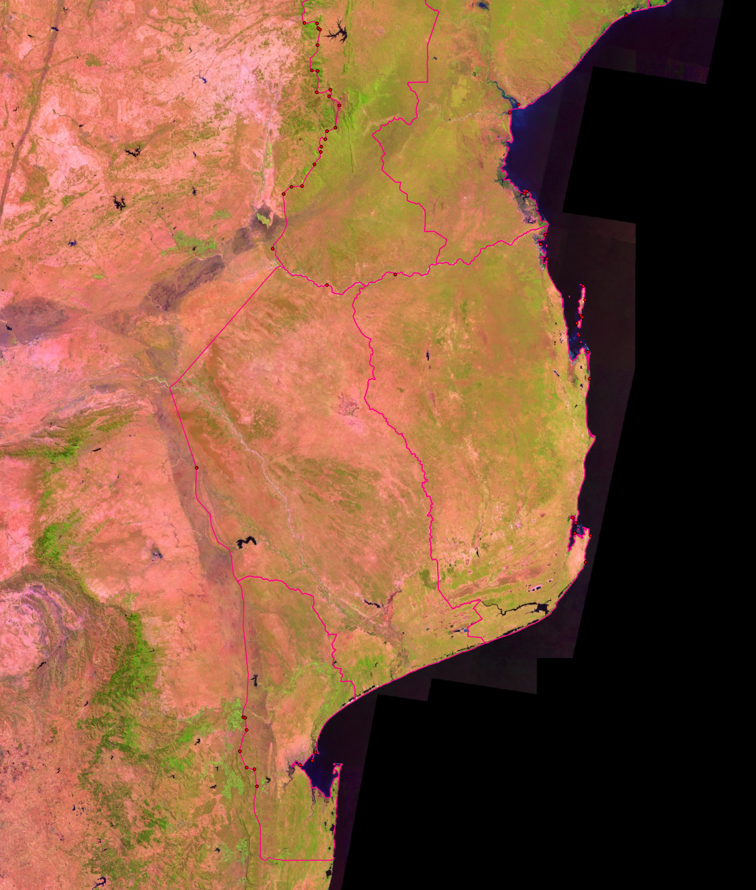

The GCPs for Mozambique's Southern Region can be found [here](gcps/MozSouth_Poly1.points). There were still small discrepancies between the
georeferenced image and the reference dataset but to correct the discrepancies would warp the polygons too much to be
a viable image.

### Georeferencing Mozambique Northern Region

**Note:** Fewer iterations were required for the Northern Region of Mozambique as it was done using knowledge gained
from georeferencing the Southern Region. The first 2 iterations were also done before the final iteration of georeferencing
the South Region of Mozambique so were done before it was decided that using the Thin Plate Spline transformation was
providing false results.

#### Georeferencing Parameters for Northern sheet

##### Test Parameters

This describes the parameters that were tested, and we found to be not adequate to use for georeferencing.

|Iteration| Transformation Type                  |Outcome|
|---------|--------------------------------------|-------|
|First| **Thin Plate Spline transformation** |All of the residual pixels were a false zero. 10 GCPs were used and resulted in good approximation that had some discrepancies between the georeferenced image and the reference dataset.|
|Second| **Thin Plate Spline transformation** |All the Residual Pixels were a false zero. Points were added to the previous attempt's GCPs to total 201 GCPs. The Northern Region of Mozambique had many small islands and outlying points that had to be 'forced' into the correct place and this caused significant warping on the image.|

##### Final Parameters Selected

After testing other types of transformations it was decided that using a `Polynomial 3 transformation` with 149 GCP
gave the best results. All the Residual Pixels for the GCPs were under 10. A polynomial 3 transformation was chosen as it
warped the image the least but had the fewest discrepancies between the reference dataset and the georeferenced
image. The image below shows the georeferencer with the GCPs on the map and the GCP table showing the residuals
being below 10 (Ground Control Point 124 has the highest Residual Pixels at 9.948533).


The image below shows the GCPs for Mozambique's Northern Region relative to the GAUL reference dataset.


The GCPs for Mozambique's Northern Region can be found [here](gcps/MozNorth_Poly3.points).

### Checking Alignment of georeferenced Mozambique Images

Due to the nature of georeferencing scanned maps, there are slight discrepancies where the sheets meet each other but
they are minimal.


The main discrepancy for Mozambique's Southern Region between the southernmost border of the **Mozambique
Hydrogeological Map_South Region** tif and the GAUL reference dataset.
<!-- At the original scale of the map (1:1 000 000) the discrepancies are within an acceptable error range. 1942.229m 
discrepancy at map scale = 1.9 mm error on the original map-->

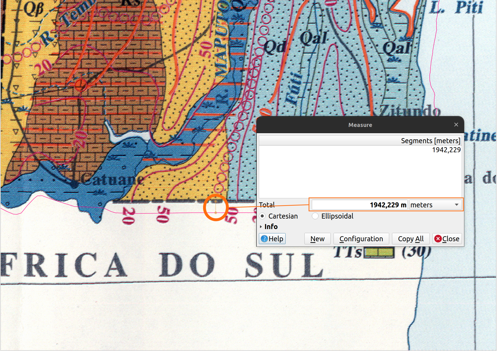

There are multiple discrepancies between the Northern Border of **Mozambique Hydrogeological Map_North Region** tif
and the GAUL reference dataset. There are discrepancies where the administration boundary on the map and the GAUL
boundary differ, and where the Ruvuma (formerly Rovuma) River's path on the **Mozambique Hydrogeological
Map_North Region** tif differs from its path on the GAUL dataset( the path on the GAUL dataset is ratified by GLAD
Landsat imagery).


A closer look at one of the worse discrepancies:
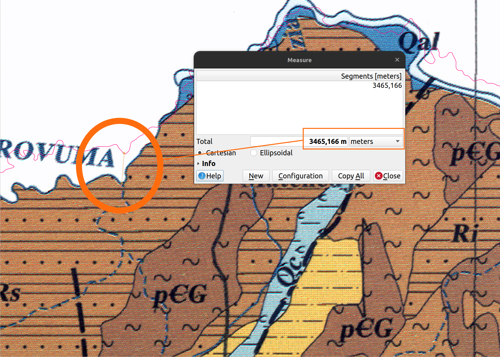

<!-- At the original scale of the map (1:1 000 000) the discrepancies are within an acceptable error range. 3465.166m
discrepancy at map scale = 3.4 mm error on the original map-->

## Zimbabwe

Four map sheets were provided to be georeferenced.

### Analysis of Map Sheets before Georeferencing

After loading the raster images into QGIS and doing some investigation. The following conclusions were established:

* Attempt to find any information about the Zimbabwe projection, datum, etc. through research. Finding the memoire for
  the sheets would be the ideal situation. The maps being from 1986 mean that their projection system was most likely
  based on the Arc 1950 datum (which is based on the Clarke 1880 ellipsoid).

* Research did not yield the projection used for creating the sheets. The projection is required to make custom
   projected CRS for better georeferencing. The closest option found during research was a report from UNESCO from
   1995 (Hydrogeological Maps A Guide and Standard Legend. Vol. 17., by Struckmeier, Wilhelm F, and Jean Margat)
   referencing the Zimbabwe Hydrogeological maps stating that "preferably UTM grid" was used for map locations.
   Using this information, a custom tmerc (Transverse mercator) projection system was made using the proj string:

    ```py
    Custom CRS: +proj=tmerc +lat_0=-19 +lon_0=30 +k=1 +x_0=0 +y_0=0 +a=6378249.145 +rf=293.4663077 +units=m +no_defs
    ```

   The Central Meridian (lon_0) and the Latitude of Origin (lat_0) were taken from the four Zimbabwe sheets and the **+a**
   and **+rf** values are for the Arc 1950 datum.

#### Georeferencing Parameters for the four sheets

Georeferencing is an iterative process, and we needed to try different parameters to establish the most suitable ones
to use.

The methods below describe the different parameters that were tested with the raster images.

##### Test Parameters

|Sheet|Iteration| Transformation Type                  |Outcome|
|-----|---------|--------------------------------------|-------|
|One|First| **Thin Plate Spline transformation** |11 GCPs were used but all the points had false zeroes for the Residual Pixels. There were multiple discrepancies between the georeferenced image and the reference image.|
|Two|First| **Thin Plate Spline transformation** |12 GCPs were used but all the points had false zeroes for the Residual Pixels. There were multiple discrepancies between the georeferenced image and the reference image.|
|Three|First| **Thin Plate Spline transformation** |8 GCPs were used but all the points had false zeroes for the Residual Pixels. There were multiple discrepancies between the georeferenced image and the reference image.|
|Four|First| **Thin Plate Spline transformation** |12 GCPs were used but all the points had false zeroes for the Residual Pixels. There were multiple discrepancies between the georeferenced image and the reference image.|

##### Final Parameters Selected

The first iteration of georeferencing Zimbabwe Sheet 4 was the best result of the initial georeferencing attempts. So it was
decided that Sheet 4 should be refined first and then used as a reference basis for the other images.

### Refining Zimbabwe Sheet 4

|Iteration| Transformation Type                  |Outcome|
|---------|--------------------------------------|-------|
|First| **Thin Plate Spline transformation** |Done using 46 GCPs, all with a false zero value for their Residual Pixels. There were still discrepancies between the GAUL reference dataset and the georeferenced sheet's boundaries.|
|Second| **Thin Plate Spline transformation** |Done using 75 GCPs, all with a false zero value for their Residual Pixels. There were still major discrepancies between the GAUL reference dataset and georeferenced sheet's boundaries. This transformation type also warped the internal polygons of the georeferenced image.|
|Third| **Polynomial 3 transformation**      |After a discussion, it was decided that the Residual Pixels from a `Thin plate Spline transformation` being zero was a false reading and so a `Polynomial 3 transformation` was chosen as it gave the best results. 42 GCPs were used with all the Residual Pixels being less than 10 (Point 16 was the GCP with the highest Residual Pixel value of 9.592993). The images below show the results of this transformation:|

The image below shows the georeferencer and part of the associated GCP table:


The image below shows the GCPs for Zimbabwe Sheet 4 relative to the GAUL reference dataset over the GLAD Landsat
dataset.


The GCPs for the `Polynomial 3 transformation` can be found [here](gcps/zimbabwe_sheet4_Poly3.points).

>**Note:** There was not a lot of spatial information in the North Western section (Central region of Zimbabwe) of the
sheet and the roads that are represented on the scanned map do not intersect with each other as they would in the
real world.

### Refining Zimbabwe Sheet 3

|Iteration| Transformation Type                  |Outcome|
|---------|--------------------------------------|-------|
|First| **Thin Plate Spline transformation** |Done using 29 GCPs, all with a false zero value for their Residual Pixels. There were significant discrepancies between the GAUL reference dataset and georeferenced sheet's boundaries.|
|Second| **Polynomial 1 transformation**      | This transformation was chosen as it gave the best result out of the transformation types. Done using 11 GCPs with all the Residual Pixels for the GCPs were lower than 10. Despite all of Sheet 3's GCPs having lower Residual Pixel values than Sheet 4's GCPs, it had greater discrepancies along its western boundary. The images below show the results of this transformation:|

The Image below shows the discrepancies along Sheet 3's western boundary


The image below shows the georeferencer and part of the associated GCP table (Point 7 was the GCP with the highest
Residual Pixel value of 1.211239):
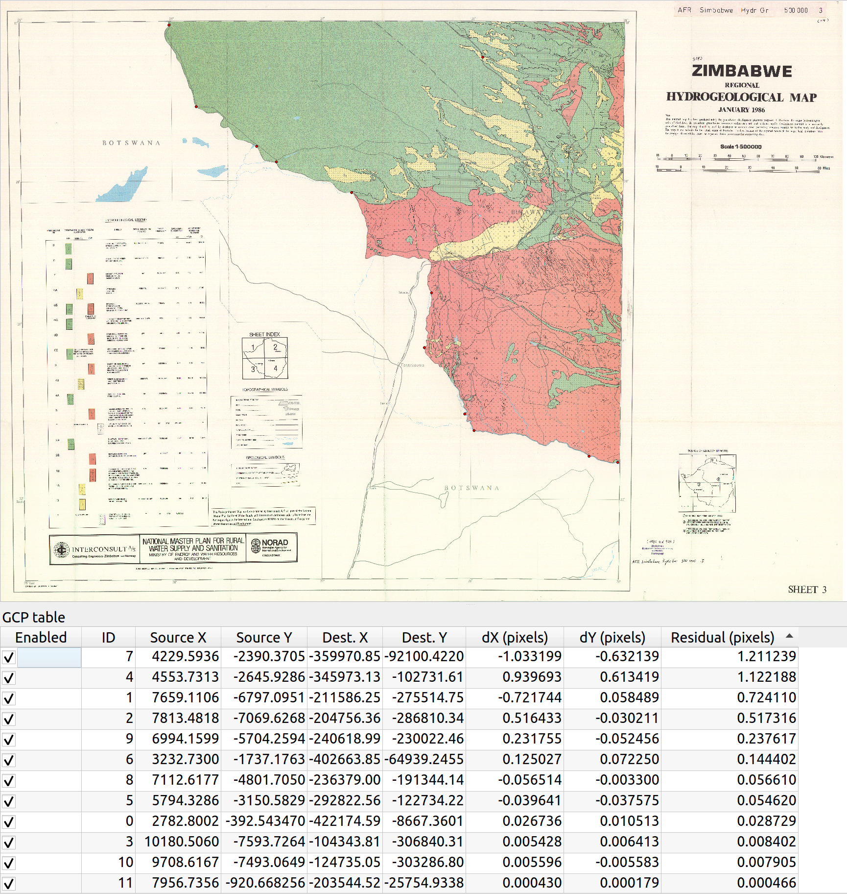

The image below shows the GCPs for Zimbabwe Sheet 4 relative to the GAUL reference dataset over the GLAD Landsat
dataset.
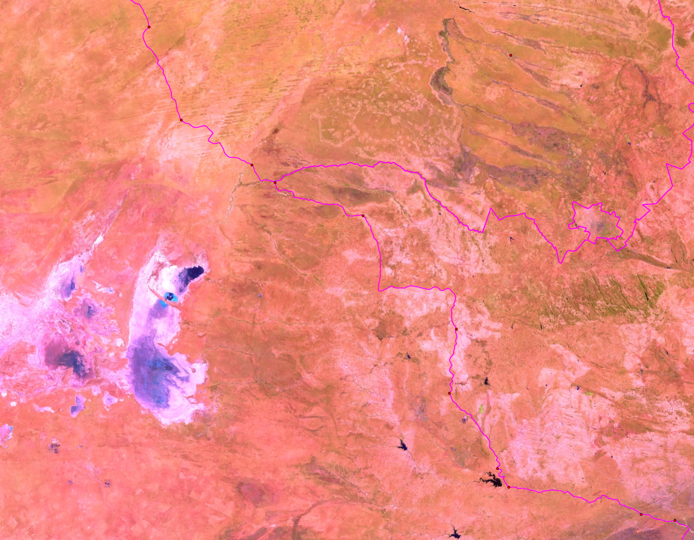

The GCPs for the `Polynomial 1 transformation` can be found [here](gcps/zimbabwe_sheet3_Poly1.points).

>**Note:** There was not a lot of spatial information in the North Eastern section (Central region of Zimbabwe) of the
sheet and the roads that are represented on the scanned map do not intersect with each other as they would in the real world.

### Refining Zimbabwe Sheet 2

|Iteration| Transformation Type                  |Outcome|
|---------|--------------------------------------|-------|
|First| **Thin Plate Spline transformation** |This was done using 53 GCPs, all with a false zero value for their Residual Pixels. There were significant discrepancies between the GAUL reference dataset and georeferenced sheet's boundaries.|
|Second| **Polynomial 3 transformation**      |This was done using 27 GCPs, where all the Residual Pixels for the GCPs were lower than 10. A `Polynomial 3 transformation` was used as it gave the best result out of the transformation types. The images below show the results of this transformation:|

The image below shows the georeferencer and part of the associated GCP table (Point 18 was the GCP with the highest
Residual Pixel value of 9.794608):


The image below shows the GCPs for Zimbabwe Sheet 2 relative to the GAUL reference dataset over the GLAD
Landsat dataset.


The GCPs for the `Polynomial 3 transformation` can be found [here](gcps/zimbabwe_sheet2_Poly3.points).

>**Note:** There was not a lot of spatial information in the South Western section (Central region of Zimbabwe) of the
sheet and the roads that are represented on the scanned map do not intersect with each other as they would in the
real world. The Great Dyke was used where it was clear that a GCP could be placed.

### Refining Zimbabwe Sheet 1

|Iteration| Transformation Type             |Outcome|
|---------|---------------------------------|-------|
|First| **Thin Plate Spline**           |This was done using 53 GCPs all with a false zero value for their Residual Pixels. There were significant discrepancies between the GAUL reference dataset and georeferenced sheet's boundaries.|
|Second| **Polynomial 1 transformation** |This was done using 23 GCPs, where all the Residual Pixels for the GCPs were lower than 10. A `Polynomial 1 transformation` was used as it gave the best result out of the transformation types. Lake Kariba would have been ideal for reference points, however in the years since the map was published Lake Kariba's water level has lowered significantly and the shoreline has changed. The images below show the results of this transformation:|

All the Residual Pixels for the GCPs were lower than 10 (Point 17 was the GCP with the highest Residual Pixel value of
7.111510).


The image below shows the GCPs for Zimbabwe Sheet 1 relative to the GAUL reference dataset over the GLAD
Landsat dataset.
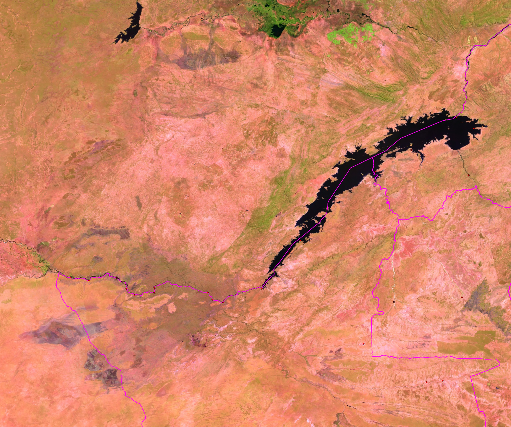

The GCPs for the `Polynomial 1 transformation` can be found [here](gcps/zimbabwe_sheet1_Poly1.points).

>**Note:** There was some clear spatial information in the South Eastern section (Central region of Zimbabwe) of the
sheet and the roads that are represented on the scanned map do not intersect with each other as they would in the
real world. The Shangani River was used where it was clear that GCPs could be placed.

### Checking Alignment of Zimbabwe sheets

Due to the nature of the scanned maps, there are discrepancies where the sheets interact with each other and there
was a lack of reference information to be used as GCPs. The main discrepancies are where the four sheets meet in the
central area of Zimbabwe. The discrepancies and their respective measurements are highlighted using the same
coloured lines in the image below. The discrepancies between sheets edges get smaller closer to the country boundary
of Zimbabwe due to there being multiple GCPs along the administration boundary.
<!-- The largest discrepancy is 2.52 km which would be an error of 2.5 mm on the original map-->


### Refining Zimbabwe Georeferencing as a whole

It was noticed that the original images provided were already warped before any form of georeferencing took place. This
meant that the original images didn't line up correctly with each other. This issue meant that the original georeferencing
had major discrepancies in the central region of Zimbabwe.

The solution to this issue was to stitch the images together in an external software (Inkscape) and then georeference
this stitched image. The stitched together image and its associated GCPs looked like this:
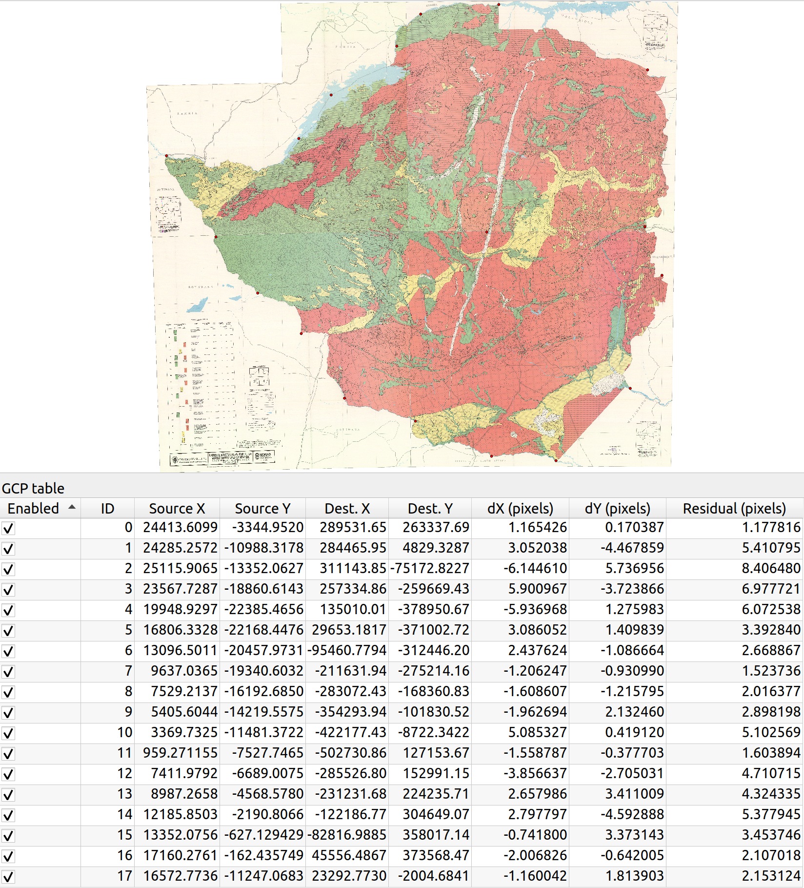

This image gave the best result of the georeferencing so was used for the digitization process.

All the Residual Pixels for the GCPs were less than 10 (Point 0 having the highest residual pixel value of 9.662356).

The GCPs from this transformation can be found [here](gcps/zim_stitched_poly3.points).

## QA (Quality Assurance)

This section is divided into three parts:

* QA for the georeferenced worksheets
* QA for the digitized vector layers
* QA for the cartography

## Georeferencing QA

The georeferenced focused on two areas split by different map sheets. The test will cover the following scenarios

* Merging layers. Zimbabwe consists of four georeferenced sheets, and we need to stitch the georeferenced layers
  into a seamless single raster image. Mozambique consists of two map sheets, and we need to establish if these
  sheets can be combined.
* Overlay with some standard open data. Vector data could be from OSM and any raster imagery.

## QA for digitized vector layers

The following checks were carried out.

* Duplicate checks and Geometry validity
* Attribute table QA
* Topology checker

### Topology checker

This primarily focuses on establishing if the vector features follow the vector topological model. Topology is a set of
rules that model the relationships between neighbouring points, lines, and polygons and determines how they share
geometry.

The following topological rules apply to the vector data:

* Boundaries should not cross each other (i.e., boundaries which would cross must be split at their intersection
  to form district boundaries). On the contrary, lines can cross each other, e.g. bridges over rivers.
* Lines and boundaries share nodes only if their endpoints are identical. Lines or boundaries can be forced to share
  a common node by snapping them together. This is particularly important since nodes are not represented in the
  coordinate file, but only implicitly as endpoints of lines and boundaries.
* Common area boundaries should appear only once (i.e., should not be double digitized).
* Areas must be explicitly closed. This means that it must be possible to complete each area by following one or
  more boundaries that are connected by common nodes, and that such tracings result in closed areas.
* It is recommended that area features and linear features be placed in separate layers. However, if area features
  and linear features must appear in one layer, common boundaries should be digitized only once. For example, a
  boundary that is also a line (e.g., a road which is also a field boundary), should be digitized as a boundary to
  complete the area(s), and a boundary which is functionally also a line should be labelled as a line by a distinct
  category number.

#### Snapping options

QGIS provides snapping tools which allow digitized vector data to follow the topological model and to be captured in a
more timely manner.

General QGIS snapping configuration:
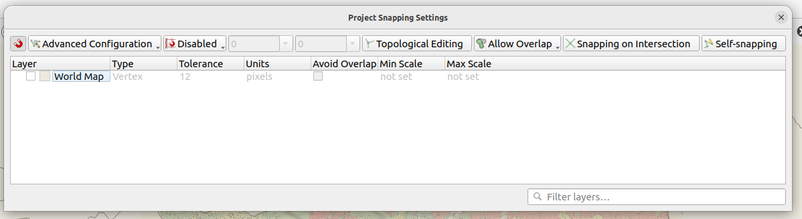

Project snapping options:
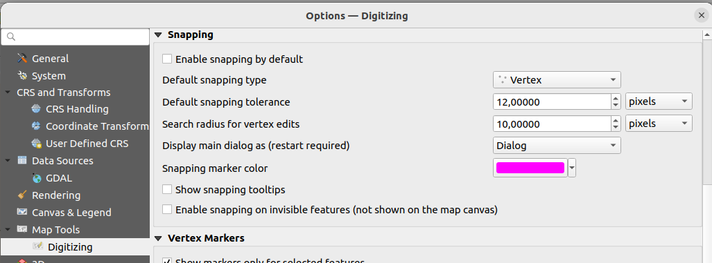

The snapping settings were the same for digitizing both Mozambique and Zimbabwe. They were set out as in the image
below:
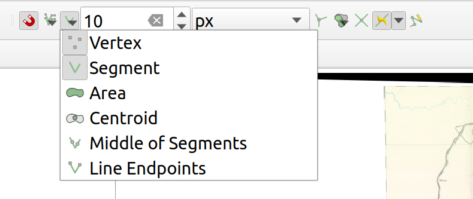

* : This means that snapping was enabled. Snapping helps to reduce the number of slivers and wedges
  created during the digitizing process.
* : This means that QGIS will snap to previously digitized vertices according to the defined tolerance.
* : This means that QGIS will snap to previously digitized segments according to the defined tolerance.
* 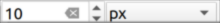: This is a user defined tolerance. For this project is was set at 10 pixels.
* : When this option is enabled QGIS will trace along previously digitized features. This feature was utilized in this project to speed up digitizing features that shared common vertices and/or segments.

#### Digitizing options

The digitizing of the various features was done using a mixture of `Digitize with Segment` and `Stream Digitizing`.
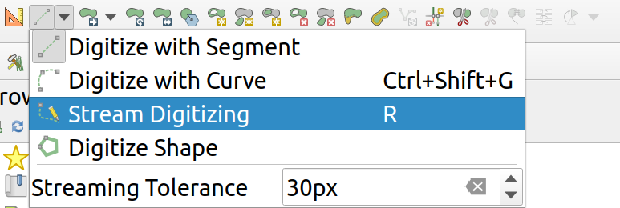

* `Digitize with Segment` was used when digitizing larger features and straighter lines.
* `Stream Digitizing` was used for smaller features and for more complex shapes within features (such as corners
  or multi-curved lines).

#### Topology checker Plugin

This was used to make sure the data conformed to the topology rules. Various rules were tested based on the data type.


Different test are applicable for dataset type. The tool allows the following rules to be tested:
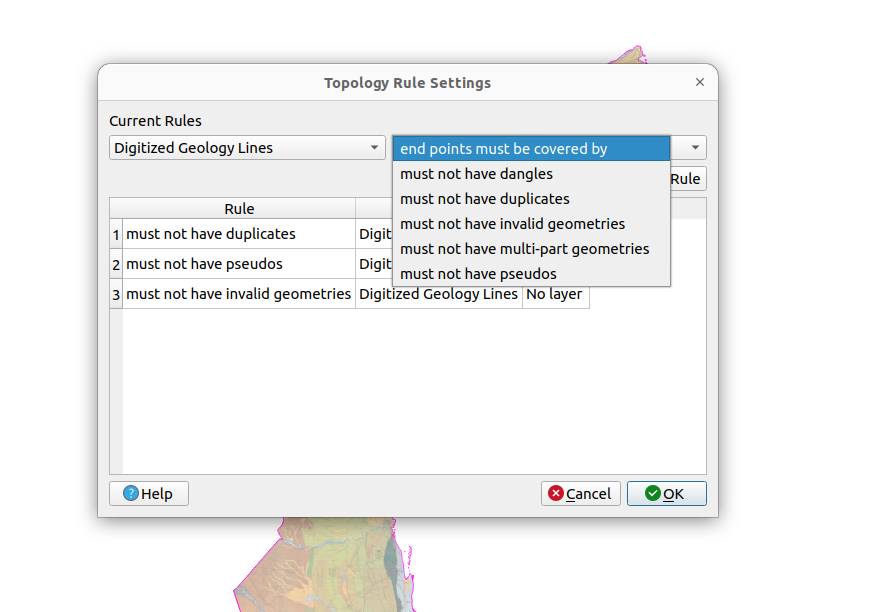

#### Geometry checker Plugin
This tool also provides a way to check if the topological relationship between features exists and are conformant.

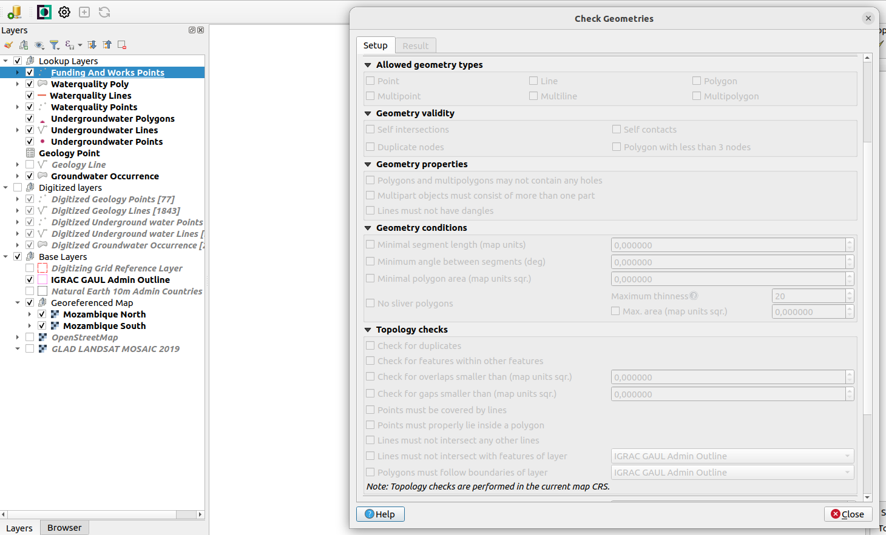

### Duplicate checks and Geometry validity

They are two modalities for duplicates:

* Duplicate by attribute table
* Duplicate by geometry values

In our case we are interested in checking for duplicates by geometry. This will show us if we have two features that
are captured at the same location. The default setting in QGIS is to run algorithms which adhere to the simple feature
specification ( valid geometry).

1. In this case we had to run the algorithm `Fix geometries`

2. This was followed by running the algorithm `delete duplicate geometries` from the vector layers.
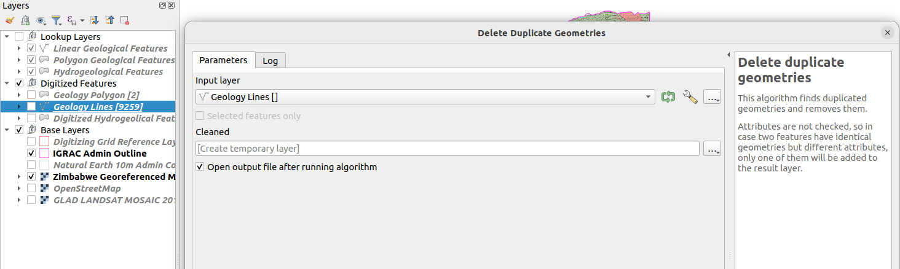

#### Check Duplicates by Symbology

Once all the duplicated features are removed from the vector features, we additionally checked for duplicates using
[QGIS Symbology](https://kartoza.com/blog/qgis/finding-and-fixing-topology-and-geometry-errors-in-qgis)

#### Check Duplicates by SQL

We ran some additional SQL commands in the `DBManager` to check for duplicates.

```sql
select geom, count(*)
from geology_lines
group by geom
HAVING count(*) > 1

```

This was run against all the layers that were generated for the Zimbabwe and Mozambique vector layers.

### Attribute table QA

This check was done in the geopackage database to check if all the values are stored with the correct values.
Since in the QGIS projects the values are linked by lookup tables.

**Lookup table in QGIS**
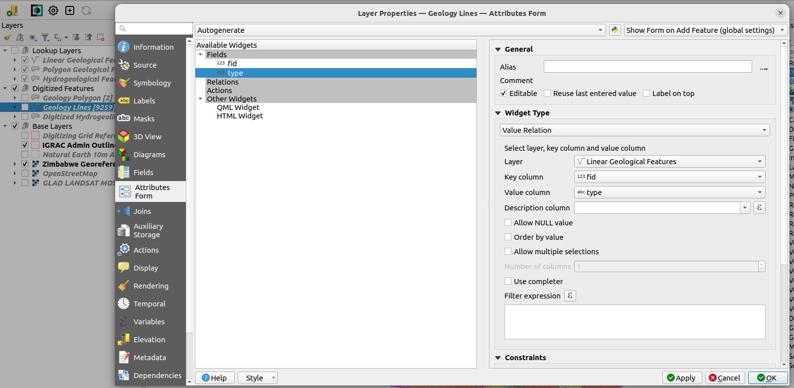

**Actual values in the geopackage**
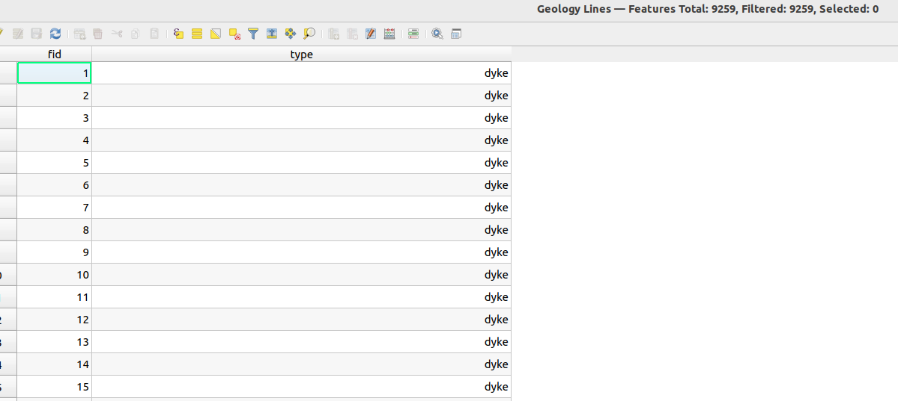

### Zimbabwe vector features

The image below depicts the vectorised features.
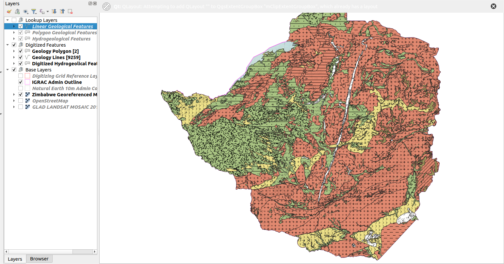

#### Geology Lines

A total of 9259 features were captured.

## QA for cartography
